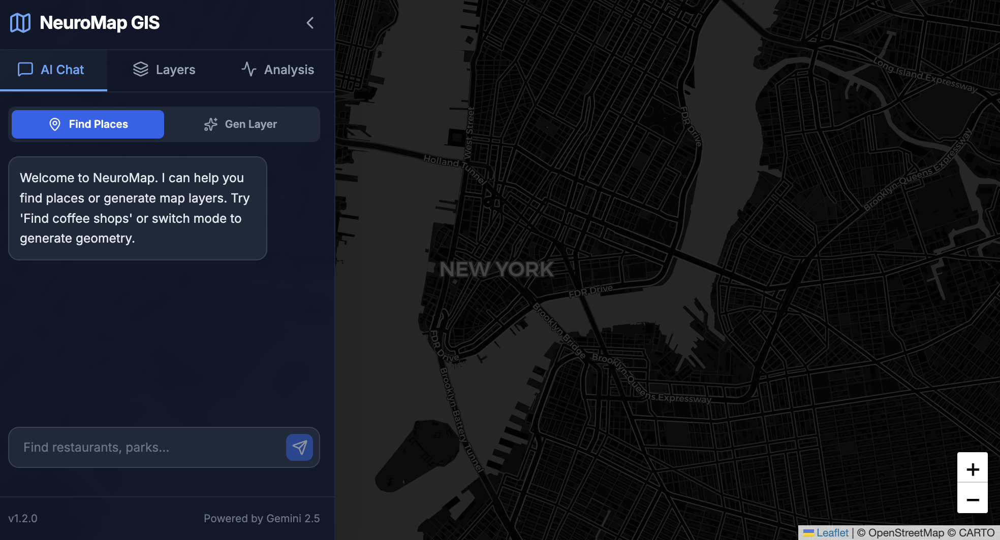
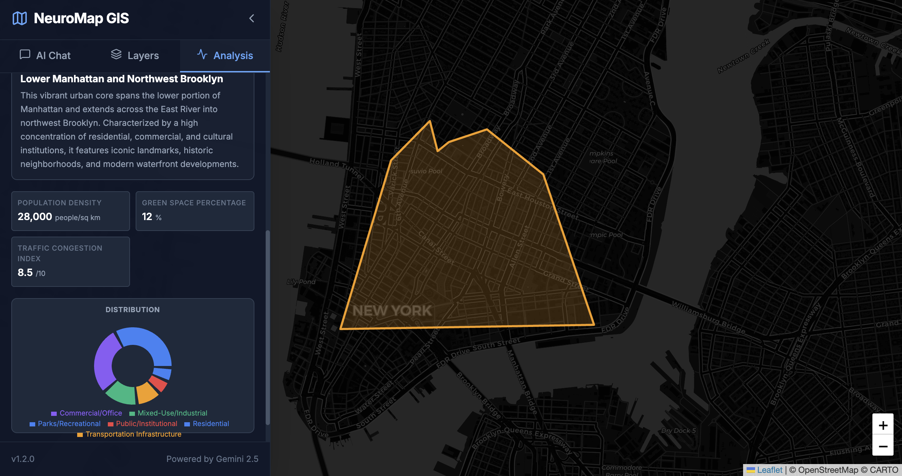

# Gemini AI GIS

A powerful geospatial analysis tool powered by Google's Gemini AI. This application combines an interactive map interface with the reasoning capabilities of Gemini to allow users to search, analyze, and visualize geographic data using natural language.

<div align="center">


</div>

## Features

-   **Natural Language Search**: Find places and geocode addresses using conversational queries.
-   **Generative Map Layers**: Create GeoJSON map layers on the fly by describing them (e.g., "Draw a polygon around Central Park").
-   **Spatial Analysis**: Analyze specific map regions to get summaries, metrics, and land use charts.
-   **Density Analysis**: Generate heatmaps for various topics (e.g., "Population density", "Traffic intensity") using AI-estimated data points.
-   **Chat Interface**: Interact with the map through a sidebar chat interface.

## Prerequisites

Before you begin, ensure you have the following installed:

-   **Node.js** (v18 or higher recommended): [Download Node.js](https://nodejs.org/)
-   **npm** (comes with Node.js)

You will also need a **Google Gemini API Key**. You can get one for free at [Google AI Studio](https://aistudio.google.com/).

## Local Setup Guide

Follow these steps to get the application running on your local machine.

### 1. Clone the Repository

```bash
git clone https://github.com/Raymond1030/Gemini_AI_GIS.git
cd Gemini_AI_GIS
```

### 2. Install Dependencies

Install the required project dependencies using npm:

```bash
npm install
```

### 3. Configure Environment Variables

1.  Create a file named `.env` or `.env.local` in the root directory.
2.  Add your Gemini API key to this file:

```env
GEMINI_API_KEY=your_actual_api_key_here
```

> [!NOTE]
> The application is configured to read `GEMINI_API_KEY` and expose it to the client side. Ensure you do not commit your `.env` file to version control.

### 4. Run the Application

Start the development server:

```bash
npm run dev
```

Open your browser and navigate to `http://localhost:3000` (or the URL shown in your terminal).

## Usage

1.  **Search**: Use the search bar to find locations (e.g., "Coffee shops in Brooklyn").
2.  **Analyze Area**: Move the map to a region of interest and click "Analyze Area" in the sidebar to get AI-generated insights.
3.  **Generate Layers**: Ask the AI to visualize data (e.g., "Show me high-risk flood zones in this area").

## Tech Stack

-   **Frontend**: React, TypeScript, Vite
-   **Maps**: Leaflet / React-Leaflet
-   **AI**: Google Gemini API (`@google/genai`)
-   **Styling**: Tailwind CSS
